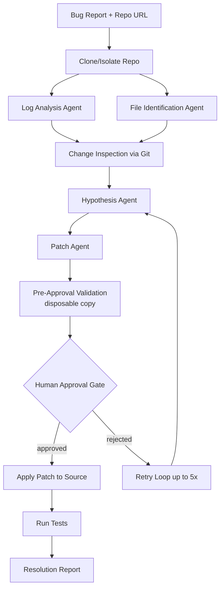

# looking at the path "C:\Users\admin\.bob\playground\DevLoop-main" analyse the code

---

**Status:** error  **Date:** 2026-09-27

---

### 👤 User

looking at the path "C:\Users\admin\.bob\playground\DevLoop-main" analyse the code

---

### 🤖 Assistant

> 🔧 called: list_files

> 🔧 **list_files** — DevLoop-main

### 🤖 Assistant

> 🔧 called: spawn_subagent

> 🔧 **spawn_subagent** — explore

### 🤖 Assistant

Here's a thorough breakdown of the **DevLoop** codebase:

---

## 🔍 Project Overview

**DevLoop** is an autonomous software debugging and repair system. It takes a bug report and repository, runs a multi-agent LLM pipeline to generate and validate a code patch, then pauses for **human approval** before applying the fix. Built for the IBM Bob 2.0 Hackathon.

---

## 🏗️ Architecture

---

## 🔧 Tech Stack

| Layer | Technology |
|---|---|
| **Frontend** | React 19 + TypeScript 6 + Vite 8 |
| **API** | FastAPI + Uvicorn |
| **Workflow Engine** | LangGraph (state machine with checkpointing) |
| **LLM** | Ollama (`qwen2.5-coder:1.5b`) or OpenAI-compatible (OpenRouter/GPT-4o-mini) |
| **Database** | SQLite + SQLAlchemy 2 |
| **Git Integration** | GitPython |
| **Deployment** | Docker (multi-stage) + Render Blueprint |

---

## 🤖 Agent Pipeline (11 LangGraph Nodes)

Defined in [`workflow.py`](DevLoop-main/backend/workflow.py):

| Step | Agent/File | What It Does |
|---|---|---|
| 1 | `clone_repo` | Isolates repo into temp workspace |
| 2 | [`log_analysis.py`](DevLoop-main/backend/agents/log_analysis.py) | Extracts exception, module, line, call chain |
| 3 | [`file_identification.py`](DevLoop-main/backend/agents/file_identification.py) | Ranks top 10 relevant files |
| 4 | `change_inspection` | Analyses last 5 git commits/diffs |
| 5 | [`hypothesis.py`](DevLoop-main/backend/agents/hypothesis.py) | Synthesises root-cause with confidence score |
| 6 | [`patch.py`](DevLoop-main/backend/agents/patch.py) | Generates unified diff, validates it |
| 7 | `pre_approval_validation` | Tests patch on throwaway copy |
| 8 | **Human Gate** | Pauses via LangGraph interrupt |
| 9 | `apply_patch` | Applies to target workspace |
| 10 | `test_runner` | Runs configured test command |
| 11 | [`report.py`](DevLoop-main/backend/agents/report.py) | Generates resolution report |

---

## 🗄️ Data Models

Defined in [`backend/models/`](DevLoop-main/backend/models/):

- [`BugReport`](DevLoop-main/backend/models/bug_report.py) — title, description, repo_url, branch, stack_trace
- [`WorkflowRun`](DevLoop-main/backend/models/workflow_run.py) — status (`pending → running → awaiting_approval → completed/failed`), workspace_dir, iteration
- [`AgentStep`](DevLoop-main/backend/models/agent_step.py) — step_name, status, evidence (JSON)
- [`ResolutionReport`](DevLoop-main/backend/models/resolution_report.py) — root_cause, changes_made (unified diff), test_results, iteration_count

---

## 🌐 API Routes

Defined in [`backend/routers/`](DevLoop-main/backend/routers/):

| Method | Endpoint | Purpose |
|---|---|---|
| `POST` | `/api/runs` | Start a new debug run |
| `GET` | `/api/runs/{run_id}` | Get run status + step evidence |
| `GET` | `/api/runs/{run_id}/events` | **SSE stream** of live agent events |
| `POST` | `/api/runs/{run_id}/approve` | Approve or reject proposed patch |
| `GET` | `/api/reports/{run_id}` | Retrieve resolution report |
| `GET` | `/api/auth/status` | Auth status check |
| `POST` | `/api/auth/login` | Token login (sets HttpOnly cookie) |
| `GET` | `/health` | Health check |

---

## 🖥️ Frontend

Single-file React app at [`frontend/src/App.tsx`](DevLoop-main/frontend/src/App.tsx):
- **Run creation form** (repo URL, branch, test command, bug description)
- **Live step timeline** (SSE consumer)
- **Patch review UI** with diff display and approve/reject buttons
- **Resolution report view**
- Dark/light theme toggle

---

## 🛠️ Key Tools & Patterns

| File | Key Capabilities |
|---|---|
| [`tools/repo_tools.py`](DevLoop-main/backend/tools/repo_tools.py) | Clone, list files, read files, hash files for source integrity, `grep_symbol` |
| [`tools/git_tools.py`](DevLoop-main/backend/tools/git_tools.py) | Recent commits, commit diffs |
| [`tools/test_tools.py`](DevLoop-main/backend/tools/test_tools.py) | Patch validation on disposable copy, `apply_patch`, `run_pytest`, patch sanitisation |
| [`agents/llm_utils.py`](DevLoop-main/backend/agents/llm_utils.py) | JSON extraction from LLM responses (strips markdown fences) |

**Notable patterns:**
- **Evidence-first**: repo content always overrides model assumptions
- **Patch repair**: sanitises LLM artifacts, repairs hunk headers
- **Retry loop**: up to 5 patch attempts, feeding failure context back
- **Source protection**: hashes workspace files before apply-to-source, verifies no mutations
- **Thread-safe SSE**: worker threads safely publish to asyncio event queues per run

---

## 🧪 Tests

57 passing tests in [`tests/`](DevLoop-main/tests/), covering:
- Full workflow with approval gate (both approve and reject paths)
- Retry loop with failure context propagation
- Apply-to-source with real Git repo verification
- Per-run SSE event queue isolation
- Cross-thread event delivery

---

## 📁 Entry Points

| File | Role |
|---|---|
| [`backend/main.py`](DevLoop-main/backend/main.py) | FastAPI app, CORS, auth middleware, router registration |
| [`backend/workflow.py`](DevLoop-main/backend/workflow.py) | `build_workflow()`, `run_workflow()`, `resume_workflow()` |
| [`backend/config.py`](DevLoop-main/backend/config.py) | Pydantic-settings: LLM provider, DB path, auth token |
| [`Dockerfile`](DevLoop-main/Dockerfile) | Multi-stage build: Node 22 (frontend) → Python 3.12 (runtime) |
| [`render.yaml`](DevLoop-main/render.yaml) | Render deployment blueprint with persistent SQLite disk |

Overall this is a well-structured, production-ready agentic system with strong separation of concerns, careful isolation guarantees, and a clean human-in-the-loop approval pattern.

---

### 👤 User

ok so in the path "C:\Users\admin\.bob\playground" there are also 10 pictures representing each slide of a presentation. Looking at the code and slide suggest some changes that make the slides more accurate and pop.  look at jpgs titled 1 thru 10

---

### 🤖 Assistant

> 🔧 called: glob

> 🔧 **glob** — *.jpg

### 🤖 Assistant

> 🔧 called: read_file, read_file, read_file, read_file, read_file

> 🔧 **read_file** — DevLoop Technical Pitch (1)_page-0003.jpg

> 🔧 **read_file** — DevLoop Technical Pitch (1)_page-0002.jpg

> 🔧 **read_file** — DevLoop Technical Pitch (1)_page-0004.jpg

> 🔧 **read_file** — DevLoop Technical Pitch (1)_page-0001.jpg

> 🔧 **read_file** — DevLoop Technical Pitch (1)_page-0005.jpg

---

### 👤 User

did you explore them?

---

### 👤 User

suggest some changes