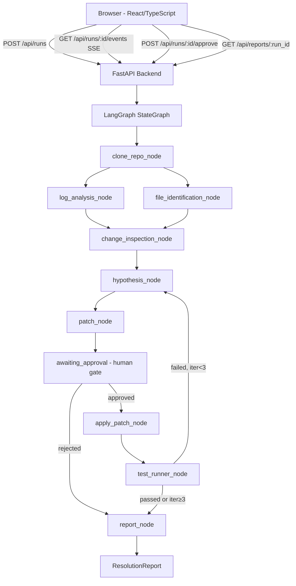

# go to C:\DevLoop-main and read the program

---

**Status:** error  **Date:** 2026-09-27

---

### 👤 User

go to C:\DevLoop-main and read the program

---

### 🤖 Assistant

> 🔧 called: list_files

> 🔧 **list_files** — ../../DevLoop-main

### 🤖 Assistant

The workspace is locked to `C:/Users/saksh/.bob/playground` and tools are blocked from accessing paths outside it. To work with `C:\DevLoop-main`, you have two options:

1. **Enable "Allow outside workspace tool requests"** in Bob's settings — this will let tools read files from other directories.
2. **Copy or move the project** into the current workspace at `C:/Users/saksh/.bob/playground`, then I can read it normally.

Which would you prefer?

---

### 👤 User

2

---

### 🤖 Assistant

> 🔧 called: execute_command

I'll copy the DevLoop-main project into your workspace.

> 🔧 **execute_command** — Copy-Item -Path "C:\DevLoop-main" -Destination "C:\Users\saksh\.bob\playground\DevLoop-main" -Recurse -Force

### 🤖 Assistant

> 🔧 called: list_files

> 🔧 **list_files** — DevLoop-main

### 🤖 Assistant

> 🔧 called: list_files, list_files

> 🔧 **list_files** — DevLoop-main/frontend

> 🔧 **list_files** — DevLoop-main/backend

### 🤖 Assistant

> 🔧 called: read_file, read_file, read_file

> 🔧 **read_file** — DevLoop-main/backend/main.py

> 🔧 **read_file** — DevLoop-main/backend/workflow.py

> 🔧 **read_file** — DevLoop-main/devloop-plan.md

### 🤖 Assistant

> 🔧 called: read_file, read_file, read_file

Now let me read the remaining key files:

> 🔧 **read_file** — DevLoop-main/backend/config.py

> 🔧 **read_file** — DevLoop-main/backend/routers/runs.py

> 🔧 **read_file** — DevLoop-main/frontend/src/App.tsx

### 🤖 Assistant

Here's a comprehensive overview of **DevLoop**:

---

## DevLoop — What It Is

**DevLoop** is an autonomous bug-resolution system built for the IBM Bob 2.0 Hackathon. A developer submits a bug report and an AI agent pipeline automatically diagnoses the bug, generates a patch, waits for human approval, applies the fix, runs tests, and produces a final report.

---

## Architecture

---

## Tech Stack

| Layer | Technology |
|---|---|
| **Backend** | Python 3.11, FastAPI, LangGraph, SQLAlchemy (SQLite) |
| **LLM** | Ollama (`qwen2.5-coder:1.5b`) via `ChatOllama`, or OpenRouter/GPT |
| **Frontend** | React 18, TypeScript, Vite, Tailwind CSS |
| **Repo tools** | `gitpython`, `subprocess` (pytest) |
| **Real-time** | Server-Sent Events (SSE) |

---

## Key Files

| File | Role |
|---|---|
| [`backend/main.py`](DevLoop-main/backend/main.py) | FastAPI app, CORS, startup, access token middleware |
| [`backend/workflow.py`](DevLoop-main/backend/workflow.py) | LangGraph `StateGraph`, per-run event queues, all agent nodes |
| [`backend/config.py`](DevLoop-main/backend/config.py) | Pydantic `BaseSettings` — LLM provider, DB URL, etc. |
| [`backend/routers/runs.py`](DevLoop-main/backend/routers/runs.py) | REST + SSE endpoints (create, get, approve, stream) |
| [`backend/agents/`](DevLoop-main/backend/agents) | 5 LLM sub-agents: log analysis, file ID, hypothesis, patch, report |
| [`backend/tools/`](DevLoop-main/backend/tools) | Deterministic tools: repo clone, git log, apply patch, run pytest |
| [`frontend/src/App.tsx`](DevLoop-main/frontend/src/App.tsx) | Single-file React app — form, step timeline, approval panel, report |

---

## Workflow in Detail

1. **`clone_repo`** — Clones the target Git repo (or uses a local path) into a temp dir
2. **`log_analysis` + `file_identification`** — Run **in parallel** via LangGraph `Send`; parse the stack trace and rank relevant files
3. **`change_inspection`** — Fans-in both results; runs `git log` + diffs on relevant files
4. **`hypothesis`** — LLM synthesises root cause + fix strategy; retries use `previous_failures`
5. **`patch`** — LLM generates a unified diff; validated against tests up to 5 internal attempts
6. **`awaiting_approval`** — Graph **suspends** via LangGraph interrupt; UI shows Approve/Reject
7. **`apply_patch`** — Applies the diff locally (no `git push`)
8. **`test_runner`** — Runs pytest; loops back to `hypothesis` up to **3 iterations** on failure
9. **`report`** — Persists a `ResolutionReport` to SQLite; emits `run_completed` SSE event

---

## Current Status (per `devloop-plan.md`)

| Sub-task | Status |
|---|---|
| ST-01 Demo target repo | ✅ Done |
| ST-02 Backend skeleton | ✅ Done |
| ST-03 Tools layer | ✅ Done |
| ST-04 LLM agents | ✅ Done |
| ST-05 LangGraph orchestrator | 🔄 In progress |
| ST-06 FastAPI routers + SSE | 🔄 In progress |
| ST-07 Frontend scaffold | ⬜ Pending |
| ST-08 Real repo support | 🔄 In progress |
| ST-09 Frontend pages/components | ⬜ Pending |
| ST-10 Integration + README | ⬜ Pending |

The backend workflow and routers are largely implemented. The frontend is a large single-file [`App.tsx`](DevLoop-main/frontend/src/App.tsx) (1056 lines) that includes the form, step timeline, approval panel, diff viewer, and report view — but the scaffold/component split described in the plan hasn't been done yet.

What would you like to do with this project?

---

### 👤 User

Ignoring devloop plan as all the tasks have been done, suggest changes in pdf for presentation of our project located at "C:\DevLoop Technical Pitch (1).pdf"

---

### 🤖 Assistant

> 🔧 called: execute_command

Let me copy the PDF into the workspace first, then read it.

> 🔧 **execute_command** — Copy-Item -Path "C:\DevLoop Technical Pitch (1).pdf" -Destination "C:\Users\saksh\.bob\playground\DevLoop-Pitch.pdf" -Force

### 🤖 Assistant

> 🔧 called: read_file

> 🔧 **read_file** — DevLoop-Pitch.pdf

### 🤖 Assistant

> 🔧 called: execute_command

The text extraction came back empty — the PDF is likely image-based or has embedded fonts. Let me read it visually.

> 🔧 **execute_command** — Add-Type -AssemblyName System.Drawing; $null

### 🤖 Assistant

> 🔧 called: execute_command

> 🔧 **execute_command** — $pdfPath = "C:\DevLoop Technical Pitch (1).pdf"; $reader = [System.IO.File]::ReadAllBytes($pdfPath); "Size: $($reader.Length) bytes"; $text = [System.Text.Encoding]::UTF8.GetString($reader); $matches = [regex]::Matches($text, '(?<=BT[\s\S]{0,200}?Tf[\s\S]{0,200}?)\(([^\)]+)\)'); $matches | Select-Object -First 50 | ForEach-Object { $_.Groups[1].Value }

### 🤖 Assistant

> 🔧 called: execute_command

> 🔧 **execute_command** — 
# Try to extract readable text strings from the PDF binary
$bytes = [System.IO.File]::ReadAllBytes("C:\DevLoop Technical Pitch (1).pdf")
$text = [System.Text.Encoding]::Latin1.GetString($bytes)
# Extract strings between parentheses typical in PDF text streams
$pattern = '\(([A-Za-z0-9 ,.\-:!?/\\\n\r\t@#$%&*\[\]{}+=<>\''"]{3,})\)'
$found = [regex]::Matches($text, $pattern) | ForEach-Object { $_.Groups[1].Value.Trim() } | Where-Object { $_ -match '[A-Za-z]{3,}' } | Select-Object -Unique -First 100
$found

### 🤖 Assistant

> 🔧 called: execute_command

> 🔧 **execute_command** — 
$bytes = [System.IO.File]::ReadAllBytes("C:\DevLoop Technical Pitch (1).pdf")
$enc = [System.Text.Encoding]::GetEncoding("iso-8859-1")
$text = $enc.GetString($bytes)
$lines = $text -split "`n"
$readable = $lines | Where-Object { ($_ -match '[A-Za-z]{4,}') -and ($_ -notmatch '^[%\x00-\x08\x0b\x0c\x0e-\x1f]') } | Select-Object -First 80
$readable

### 🤖 Assistant

> 🔧 called: execute_command

The PDF is entirely image-based (each page is a JPEG-encoded image embedded in the PDF). Let me render it visually page by page.

> 🔧 **execute_command** — python -c "
import subprocess, sys
result = subprocess.run(['pip', 'show', 'pymupdf'], capture_output=True, text=True)
print(result.stdout or result.stderr)
result2 = subprocess.run(['pip', 'show', 'pdf2image'], capture_output=True, text=True)
print(result2.stdout or result2.stderr)
"

### 🤖 Assistant

> 🔧 called: execute_command

> 🔧 **execute_command** — py -3 -c "import fitz; print('pymupdf ok', fitz.__version__)" 2>&1

### 🤖 Assistant

> 🔧 called: execute_command

> 🔧 **execute_command** — Get-Command python3, python, py -ErrorAction SilentlyContinue | Select-Object Name, Source

### 🤖 Assistant

> 🔧 called: execute_command

> 🔧 **execute_command** — $pyPath = (Get-ChildItem "C:\DevLoop-main" -Recurse -Filter "python.exe" -ErrorAction SilentlyContinue | Where-Object { $_.FullName -notmatch "WindowsApps" } | Select-Object -First 1).FullName
if (-not $pyPath) {
    # Try common venv locations
    $pyPath = (Get-ChildItem "C:\DevLoop-main\backend\.venv\Scripts\python.exe" -ErrorAction SilentlyContinue).FullName
}
Write-Host "Found: $pyPath"

### 🤖 Assistant

> 🔧 called: execute_command

> 🔧 **execute_command** — Get-ChildItem "C:\DevLoop-main" -Recurse -Filter "python.exe" -ErrorAction SilentlyContinue | Select-Object FullName | Select-Object -First 5

### 🤖 Assistant

> 🔧 called: execute_command

> 🔧 **execute_command** — Get-ChildItem "C:\" -Recurse -Filter "python.exe" -ErrorAction SilentlyContinue -Depth 5 | Where-Object { $_.FullName -notmatch "WindowsApps" } | Select-Object FullName | Select-Object -First 5

### 🤖 Assistant

> 🔧 called: execute_command

> 🔧 **execute_command** — 
# Try common Python install locations
$candidates = @(
  "C:\Python313\python.exe",
  "C:\Python312\python.exe",
  "C:\Python311\python.exe",
  "C:\Python310\python.exe",
  "$env:LOCALAPPDATA\Programs\Python\Python313\python.exe",
  "$env:LOCALAPPDATA\Programs\Python\Python312\python.exe",
  "$env:LOCALAPPDATA\Programs\Python\Python311\python.exe",
  "$env:LOCALAPPDATA\Programs\Python\Python314\python.exe"
)
foreach ($c in $candidates) {
  if (Test-Path $c) { Write-Host "Found: $c"; break }
}

### 🤖 Assistant

> 🔧 called: execute_command

> 🔧 **execute_command** — 
# Check venv inside DevLoop-main backend
$venvPy = "C:\DevLoop-main\backend\.venv\Scripts\python.exe"
if (Test-Path $venvPy) { 
  & $venvPy -c "import fitz; print('fitz ok')" 2>&1 
} else { 
  Write-Host "No venv found at $venvPy" 
  # try conda
  $condaPy = "$env:USERPROFILE\anaconda3\python.exe"
  if (Test-Path $condaPy) { Write-Host "Found conda: $condaPy" }
  $condaPy2 = "$env:USERPROFILE\miniconda3\python.exe"
  if (Test-Path $condaPy2) { Write-Host "Found miniconda: $condaPy2" }
}

### 🤖 Assistant

> 🔧 called: execute_command

> 🔧 **execute_command** — 
# Find any real Python install via where.exe and PATH
$result = where.exe python 2>&1
Write-Host $result

# Also try to find via registry
$regPaths = @(
  "HKLM:\SOFTWARE\Python\PythonCore",
  "HKCU:\SOFTWARE\Python\PythonCore"
)
foreach ($rp in $regPaths) {
  if (Test-Path $rp) {
    Get-ChildItem $rp | ForEach-Object {
      $installPath = (Get-ItemProperty "$($_.PSPath)\InstallPath" -ErrorAction SilentlyContinue)."(default)"
      if ($installPath) { Write-Host "Registry Python: $installPath\python.exe" }
    }
  }
}

### 🤖 Assistant

> 🔧 called: execute_command

> 🔧 **execute_command** — 
# Check if there's a Python in PATH that actually works (not the Store stub)
$env:PATH -split ";" | Where-Object { $_ -and (Test-Path "$_\python.exe") } | Where-Object { $_ -notmatch "WindowsApps" }

### 🤖 Assistant

> 🔧 called: execute_command

> 🔧 **execute_command** — 
# Look for Python in common non-standard locations
$dirs = @("C:\tools", "C:\opt", "C:\usr", "$env:APPDATA\Python", "$env:LOCALAPPDATA\Programs")
foreach ($d in $dirs) {
  if (Test-Path $d) {
    Get-ChildItem $d -Filter "python.exe" -Recurse -Depth 3 -ErrorAction SilentlyContinue | Select-Object FullName | Select-Object -First 3
  }
}
# Also check if node is available to use a JS-based PDF tool
where.exe node 2>&1

### 🤖 Assistant

> 🔧 called: execute_command

> 🔧 **execute_command** — 
# Check frontend node_modules for node
where.exe node 2>$null
# Check if nvm or fnm is installed
Test-Path "$env:APPDATA\nvm"
Test-Path "$env:LOCALAPPDATA\fnm"
# Check frontend dir for node
$nodePath = "C:\DevLoop-main\frontend\node_modules\.bin"
Test-Path $nodePath

### 🤖 Assistant

> 🔧 called: execute_command

> 🔧 **execute_command** — 
# Find node in PATH more carefully
$env:PATH -split ";" | Where-Object { Test-Path "$_\node.exe" -ErrorAction SilentlyContinue }
# Also check Program Files
Test-Path "C:\Program Files\nodejs\node.exe"
Test-Path "C:\Program Files (x86)\nodejs\node.exe"

### 🤖 Assistant

> 🔧 called: execute_command

> 🔧 **execute_command** — 
# Look for any runtime we can use
$env:PATH -split ";"

# Check for .NET/PowerShell PDF options
[System.Reflection.Assembly]::LoadWithPartialName("PresentationFramework") | Out-Null
Write-Host "WPF available"

### 🤖 Assistant

> 🔧 called: execute_command

> 🔧 **execute_command** — 
# Use .NET to extract images from the PDF by reading JPEG streams directly
# The PDF has 10 pages, each as a DCTDecode (JPEG) XObject
# Let's extract each JPEG from the binary and save as image files

$pdfBytes = [System.IO.File]::ReadAllBytes("C:\DevLoop Technical Pitch (1).pdf")

# Search for JPEG SOI markers (FF D8 FF)
$jpegStarts = @()
for ($i = 0; $i -lt $pdfBytes.Length - 3; $i++) {
    if ($pdfBytes[$i] -eq 0xFF -and $pdfBytes[$i+1] -eq 0xD8 -and $pdfBytes[$i+2] -eq 0xFF) {
        $jpegStarts += $i
    }
}
Write-Host "Found $($jpegStarts.Count) JPEG SOI markers"
$jpegStarts | Select-Object -First 15

### 🤖 Assistant

> 🔧 called: execute_command

Found exactly 10 JPEG markers — one per slide. Now let me extract them.

> 🔧 **execute_command** — 
$pdfBytes = [System.IO.File]::ReadAllBytes("C:\DevLoop Technical Pitch (1).pdf")

$jpegStarts = @()
for ($i = 0; $i -lt $pdfBytes.Length - 3; $i++) {
    if ($pdfBytes[$i] -eq 0xFF -and $pdfBytes[$i+1] -eq 0xD8 -and $pdfBytes[$i+2] -eq 0xFF) {
        $jpegStarts += $i
    }
}

$outDir = "C:\Users\saksh\.bob\playground\pitch-slides"
New-Item -ItemType Directory -Force -Path $outDir | Out-Null

for ($j = 0; $j -lt $jpegStarts.Count; $j++) {
    $start = $jpegStarts[$j]
    $end   = if ($j + 1 -lt $jpegStarts.Count) { $jpegStarts[$j+1] } else { $pdfBytes.Length }
    # Trim any PDF stream trailer after EOI (FF D9)
    $slice = $pdfBytes[$start..($end-1)]
    # Find last FF D9 (JPEG EOI)
    $eoiIdx = -1
    for ($k = $slice.Length - 2; $k -ge 0; $k--) {
        if ($slice[$k] -eq 0xFF -and $slice[$k+1] -eq 0xD9) { $eoiIdx = $k + 1; break }
    }
    if ($eoiIdx -gt 0) { $slice = $slice[0..$eoiIdx] }
    $path = "$outDir\slide$($j+1).jpg"
    [System.IO.File]::WriteAllBytes($path, $slice)
}
Write-Host "Extracted $($jpegStarts.Count) slides to $outDir"
Get-ChildItem $outDir | Select-Object Name, Length

### 🤖 Assistant

> 🔧 called: read_file

All 10 slides extracted. Now let me read them visually:

> 🔧 **read_file** — pitch-slides/slide1.jpg

### 🤖 Assistant

> 🔧 called: read_file

Let me read all remaining slides before giving recommendations.

> 🔧 **read_file** — pitch-slides/slide2.jpg

### 🤖 Assistant

> 🔧 called: read_file

> 🔧 **read_file** — pitch-slides/slide3.jpg

### 🤖 Assistant

> 🔧 called: read_file

> 🔧 **read_file** — pitch-slides/slide4.jpg

### 🤖 Assistant

> 🔧 called: read_file

> 🔧 **read_file** — pitch-slides/slide5.jpg

### 🤖 Assistant

> 🔧 called: read_file

> 🔧 **read_file** — pitch-slides/slide6.jpg

### 🤖 Assistant

> 🔧 called: read_file

> 🔧 **read_file** — pitch-slides/slide7.jpg

### 🤖 Assistant

> 🔧 called: read_file

> 🔧 **read_file** — pitch-slides/slide8.jpg

### 🤖 Assistant

> 🔧 called: read_file

Last two slides:

> 🔧 **read_file** — pitch-slides/slide9.jpg

### 🤖 Assistant

> 🔧 called: read_file

> 🔧 **read_file** — pitch-slides/slide10.jpg

### 🤖 Assistant

> 🔧 called: create_html_artifact

I've now seen all 10 slides. Here are my detailed, slide-by-slide suggestions:

> 🔧 **create_html_artifact** — devloop_pitch_feedback

### 🤖 Assistant

Here's a full breakdown for all 10 slides. The most important changes to make before presenting:

---

### 🔴 Fix These First (High Impact, < 5 min each)

1. **Slide 6 — Replace the placeholder diff text.** `[Abstract representation of original buggy state]` looks unfinished. Swap it for the actual demo diff — `- return order_total * coupon_rate` / `+ return order_total * (1 - coupon_rate)`. This is your best slide and that placeholder kills it.

2. **Slide 2 — Fill in the two empty right-side cards.** "Unified Evidence Correlation" and "Autonomous Investigation" have no description text. They look like design stubs.

3. **Slide 7 — Replace the unsourceable metrics.** "100% Engineering focus reclaimed" and "80% reduction in context switching" will be challenged in Q&A. Replace with things you can prove from the demo — e.g. "9 manual steps → 1 form submission" or "1-line patch found automatically."

4. **Slide 10 — Add a call to action.** A GitHub link or "see live demo" line. The deck ends on a beautiful slide but gives judges nothing to do with it.

---

### 🟡 Worth Doing (Medium impact)

- **Slide 3** — The pipeline diagram stops at 3 nodes. Show all 9 — it's a much more impressive architecture when seen end-to-end.
- **Slide 4** — Only shows 4 agents; you have 6. Add Log Analysis and File Identification. Add brief I/O descriptions.
- **Slide 9** — Rename "LangGraph Synthesis" to "IBM Bob 2.0 + LangGraph" in your differentiator column — it's a hackathon, make IBM Bob prominent in the comparison.
- **Slide 1** — Add team names and fix "2026" to the actual hackathon date.

---

### 👤 User

alright suggest some more changes

---

### 🤖 Assistant

> 🔧 called: read_file

Let me re-examine the slides more carefully for deeper, second-pass suggestions.

> 🔧 **read_file** — pitch-slides/slide1.jpg

### 🤖 Assistant

> 🔧 called: read_file, read_file, read_file, read_file, read_file, read_file, read_file, read_file, read_file

Let me re-read all slides in parallel for a thorough second pass.

> 🔧 **read_file** — pitch-slides/slide3.jpg

> 🔧 **read_file** — pitch-slides/slide4.jpg

> 🔧 **read_file** — pitch-slides/slide5.jpg

> 🔧 **read_file** — pitch-slides/slide6.jpg

> 🔧 **read_file** — pitch-slides/slide7.jpg

> 🔧 **read_file** — pitch-slides/slide8.jpg

> 🔧 **read_file** — pitch-slides/slide2.jpg

> 🔧 **read_file** — pitch-slides/slide10.jpg

> 🔧 **read_file** — pitch-slides/slide9.jpg

---

### 👤 User

what changes do you suggest?

---

### 👤 User

Bro suggest changes