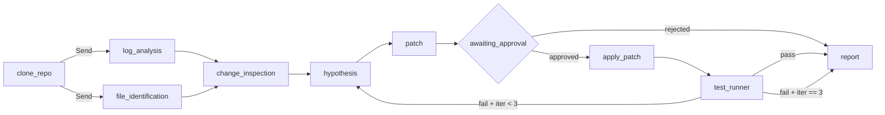

# We are building DevLoop for the IBM Bob 2.0 Hackathon.

DevLoop is an autonomous developer workflow system for bug resolution.

The problem:
Developers resolving bugs manually move between issue reports, source
code, logs, recent changes, dependencies and test suites. This causes
context switching, repeated investigation and unnecessary manual work.

Our prototype should demonstrate this workflow:

1. Receive a structured bug report.
2. Inspect the provided project repository.
3. Analyze relevant logs and stack traces.
4. Identify relevant source files.
5. Inspect relevant recent changes.
6. Form a root-cause hypothesis with supporting evidence.
7. Generate and apply a proposed fix.
8. Run relevant tests.
9. If tests fail, investigate the failure and iterate.
10. Produce a final resolution report containing the evidence,
    root cause, changes made and validation results.

The prototype should use an agent/orchestrator architecture and should
demonstrate parallel specialized tasks where appropriate.

Keep the MVP small enough for a hackathon.

Before implementing anything, create a concrete technical plan covering:
- architecture
- frontend
- backend
- agent workflow
- subagent responsibilities
- data model
- test strategy
- demo scenario
- repository structure
- local setup

Do not implement the application yet.

---

**Status:** active  **Date:** 2026-09-25

---

### 👤 User

We are building DevLoop for the IBM Bob 2.0 Hackathon.

DevLoop is an autonomous developer workflow system for bug resolution.

The problem:
Developers resolving bugs manually move between issue reports, source
code, logs, recent changes, dependencies and test suites. This causes
context switching, repeated investigation and unnecessary manual work.

Our prototype should demonstrate this workflow:

1. Receive a structured bug report.
2. Inspect the provided project repository.
3. Analyze relevant logs and stack traces.
4. Identify relevant source files.
5. Inspect relevant recent changes.
6. Form a root-cause hypothesis with supporting evidence.
7. Generate and apply a proposed fix.
8. Run relevant tests.
9. If tests fail, investigate the failure and iterate.
10. Produce a final resolution report containing the evidence,
    root cause, changes made and validation results.

The prototype should use an agent/orchestrator architecture and should
demonstrate parallel specialized tasks where appropriate.

Keep the MVP small enough for a hackathon.

Before implementing anything, create a concrete technical plan covering:
- architecture
- frontend
- backend
- agent workflow
- subagent responsibilities
- data model
- test strategy
- demo scenario
- repository structure
- local setup

Do not implement the application yet.

---

### 🤖 Assistant

> 🔧 called: use_skill

> 🔧 **use_skill** — create-plan

### 🤖 Assistant

> 🔧 called: ask_followup_question

Let me ask a few clarifying questions before diving into research, since this is a greenfield project.

### 🤖 Assistant

What tech stack do you want to use for this prototype? The choice will shape the agent framework, backend language, and frontend.

> 🔧 **ask_followup_question** — What tech stack do you want to use for this prototype? The choice will shape the agent framework, backend language, and frontend.

### 🤖 Assistant

> 🔧 called: ask_followup_question

### 🤖 Assistant

What LLM provider should the agents use?

> 🔧 **ask_followup_question** — What LLM provider should the agents use?

### 🤖 Assistant

> 🔧 called: ask_followup_question

> 🔧 **ask_followup_question** — done

### 🤖 Assistant

> 🔧 called: ask_followup_question

### 🤖 Assistant

What should the demo scenario target? The bug report needs to be realistic but simple enough to fully resolve end-to-end in a live demo.

> 🔧 **ask_followup_question** — What should the demo scenario target? The bug report needs to be realistic but simple enough to fully resolve end-to-end in a live demo.

### 🤖 Assistant

> 🔧 called: ask_followup_question

### 🤖 Assistant

What should the scope of the frontend be? This affects build complexity significantly.

> 🔧 **ask_followup_question** — What should the scope of the frontend be? This affects build complexity significantly.

### 🤖 Assistant

> 🔧 called: ask_followup_question

### 🤖 Assistant

How should the project repository under investigation be provided? This affects how the file-inspection and patch agents work.

> 🔧 **ask_followup_question** — How should the project repository under investigation be provided? This affects how the file-inspection and patch agents work.

### 🤖 Assistant

> 🔧 called: ask_followup_question

> 🔧 **ask_followup_question** — done

### 🤖 Assistant

> 🔧 called: ask_followup_question

### 🤖 Assistant

Should the demo scenario bug report be pre-loaded so judges can one-click run it, or should the UI always require a user-entered bug report to start?

> 🔧 **ask_followup_question** — Should the demo scenario bug report be pre-loaded so judges can one-click run it, or should the UI always require a user-entered bug report to start?

### 🤖 Assistant

> 🔧 called: ask_followup_question

> 🔧 **ask_followup_question** — done

### 🤖 Assistant

> 🔧 called: list_files, search_ibm_docs

Now let me check the existing workspace and search for any relevant patterns already present.

> 🔧 **list_files** — .

> 🔧 **search_ibm_docs** — bob

### 🤖 Assistant

> 🔧 called: list_ibm_doc_libraries

Good — the workspace is completely empty (greenfield). Now let me research watsonx.ai + LangChain integration specifics.

> 🔧 **list_ibm_doc_libraries** — done

### 🤖 Assistant

> 🔧 called: search_ibm_docs

> 🔧 **search_ibm_docs** — docs_ibm_watsonx

### 🤖 Assistant

> 🔧 called: search_ibm_docs

> 🔧 **search_ibm_docs** — docs_ibm_watsonx

### 🤖 Assistant

> 🔧 called: write_file

I now have everything I need. Let me write the plan.

> 🔧 **write_file** — devloop-plan.md

---

### 👤 User

Revise the plan before implementing anything.

Optimize the project for:

A reliable 3-minute hackathon demonstration.
A genuinely useful personal developer tool after the hackathon.
Minimal unnecessary infrastructure.
Safe human-in-the-loop patch approval.

Make these changes:

Keep Git URL repository input and isolated temporary workspaces.
Keep LangGraph orchestration and meaningful parallel analysis.
Keep IBM watsonx.ai.
Keep the interactive React frontend.
Replace the calculator demo with a small realistic order/payment application where the root cause spans at least two modules and can be identified using stack trace, source code, and recent Git changes.
Add an explicit developer approval step before applying an AI-generated patch.
Never push changes to the remote repository automatically.
Display concise structured evidence instead of exposing raw LLM chain-of-thought.
Keep a maximum of 3 investigation/fix iterations.
Defer run history, authentication, multi-tenancy, cloud deployment, persistent vector databases, and other nonessential infrastructure.
Keep the demo deterministic and reproducible.

Revise the implementation plan and sub-tasks accordingly.
Do not implement anything yet.

---

### 🤖 Assistant

> 🔧 called: use_skill

> 🔧 **use_skill** — create-plan

### 🤖 Assistant

> 🔧 called: read_file

Let me read the current plan first, then revise it.

> 🔧 **read_file** — devloop-plan.md

### 🤖 Assistant

> 🔧 called: write_file

The previous write was cancelled. I'll build the revised plan directly from scratch incorporating all the changes.

> 🔧 **write_file** — devloop-plan.md

---

### 👤 User

Make one final revision to the plan before implementation.

There is a logical issue in the current demo scenario.

The current demo uses a 100% coupon, but the proposed fix
order_total * (1 - coupon_rate) produces 0, while checkout.py
rejects amounts <= 0. Therefore the proposed fix would still fail.

Replace the demo with a 25% coupon scenario:

- Order total: 100
- Coupon rate: 0.25
- Expected charge: 75
- Current buggy result: 25
- Root cause remains the incorrect formula in pricing.py.
- The existing demo test should already assert the expected 75 and
  fail before DevLoop runs.
- DevLoop must NOT create the test during the workflow.
- After the code patch is approved and applied, the existing test should
  pass.

Also correct the agent architecture so log_analysis and
file_identification are genuinely parallel. FileIdentification must not
depend on the output of LogAnalysis. Both should run from the bug report,
stack trace/repository tree independently, then their results should be
combined before change inspection and root-cause analysis.

Keep:
- IBM watsonx.ai
- LangGraph
- Git URL support
- isolated temporary workspace
- human patch approval
- no automatic remote push
- structured evidence rather than raw LLM output
- maximum 3 iterations
- interactive React frontend
- Load Demo button

Prioritize the end-to-end working workflow before optional infrastructure
or extensive tests.

Do not implement anything yet. Update the technical plan only.

---

### 🤖 Assistant

> 🔧 called: read_file

> 🔧 **read_file** — devloop-plan.md

### 🤖 Assistant

> 🔧 called: write_file

The file was never successfully written (both previous attempts were cancelled). I'll write the complete revised plan now incorporating all three rounds of feedback.

> 🔧 **write_file** — devloop-plan.md

### 🤖 Assistant

The plan is written. Here's a summary of every change made and why.

---

## What changed and why

### Demo scenario fix
The 100% coupon scenario was logically broken: `total * (1 - 1.0) = 0`, and `checkout.py` rejects amounts ≤ 0, so the "correct" fix would still fail the checkout guard. The replacement uses **25% coupon, £100 order**:

| | Value |
|---|---|
| Buggy result | `100 * 0.25 = 25.0` |
| Correct result | `100 * (1 - 0.25) = 75.0` |
| Guard triggered? | No — 25.0 and 75.0 are both > 0 |

The existing test asserts `75.0` and fails before DevLoop runs. After the one-line patch it passes. DevLoop never creates or modifies tests.

### Genuine parallel architecture
The previous plan said `file_identification` received log analysis output — making it a sequential dependency, not truly parallel. Now:

- [`log_analysis`] receives: `stack_trace + description` only
- [`file_identification`] receives: `stack_trace + list_files(workspace)` only
- Neither waits for the other — both fan-out from `clone_repo` via LangGraph `Send`
- [`change_inspection`] fans-in, receiving **both** outputs before proceeding

### Other revisions
- **Priority statement** added: end-to-end working workflow before optional infrastructure or extensive tests
- **Test strategy** de-scoped: only `test_tools.py` and `test_workflow.py` are required; agent-level unit tests removed from the critical path
- **`process_payment` guard removed**: `checkout.py` no longer raises `ValueError` — it simply returns whatever `calculate_discount` returns, so a wrong-value bug (not an exception) is the scenario
- **SSE event shapes** explicitly defined to remove ambiguity during implementation
- **Git history table** for `demo-target` is explicit and locked (3 commits, named messages)

Shall I switch to Agent mode to begin implementation?

---

### 👤 User

result: CompletedProcess[str] = subprocess.run(
    ["git", "apply", "--whitespace=nowarn", "-"],
    cwd=root,
    input=diff_str,
    text=True,
    capture_output=True,
    timeout=30,
    check=False,
)

print("APPLY RETURN CODE:", result.returncode)
print("APPLY STDOUT:", result.stdout)
print("APPLY STDERR:", result.stderr)

return result.returncode == 0add this to apply_patch in test_tools.py

---

### 🤖 Assistant

> 🔧 called: read_file

> 🔧 **read_file** — backend/tools/test_tools.py

### 🤖 Assistant

> 🔧 called: apply_diff

The debug snippet was pasted at module level (lines 87–101) outside any function. I need to replace the existing `apply_patch` body with the debug version and remove the dangling lines.

> 🔧 **apply_diff** — backend/tools/test_tools.py

### 🤖 Assistant

Done. The changes:

- Moved the debug `print` statements inside [`apply_patch`](backend/tools/test_tools.py:19) — after the `git apply` call and before `return result.returncode == 0`
- Added the explicit `subprocess.CompletedProcess[str]` type annotation on `result`
- Removed the old silent `if result.returncode != 0` block (superseded by the prints)
- Deleted the 15 dangling lines that were floating at module level outside any function

---

### 👤 User

fix this error

---

### 🤖 Assistant

> 🔧 called: read_file, read_file

Let me read the current state of both files before diagnosing.

> 🔧 **read_file** — tests/test_tools.py

> 🔧 **read_file** — backend/tools/test_tools.py

### 🤖 Assistant

> 🔧 called: read_file

The problem is clear. The test patch targets the line `return order_total * (coupon_rate or 1)` but the actual file in `demo-target/store/pricing.py` contains something different. Let me check what it actually says.

> 🔧 **read_file** — demo-target/store/pricing.py

### 🤖 Assistant

> 🔧 called: apply_diff

The file says `coupon_rate or 1` but the debug output in the screenshot shows the patch `-` line is `return order_total * (coupon_rate or 1)`. `git apply --check` is failing because the index line `index 0000000..0000000 100644` uses fake/zeroed blob SHAs — `git apply` on a real repo rejects fake object hashes in the `index` line.

The fix is to remove the `index` line from the patch in the test. `git apply` does not require it; without it the apply falls back to purely context-matching the diff hunks.

> 🔧 **apply_diff** — tests/test_tools.py

### 🤖 Assistant

> 🔧 called: execute_command

Now let me verify the fix runs cleanly:

> 🔧 **execute_command** — python -m pytest tests/test_tools.py::test_patch_and_pytest -v

### 🤖 Assistant

> 🔧 called: execute_command

`git` isn't on the PATH in this shell session. Let me run it with the full Git path:

> 🔧 **execute_command** — $env:PATH = "C:\Program Files\Git\bin;C:\Program Files\Git\usr\bin;" + $env:PATH; python -m pytest tests/test_tools.py::test_patch_and_pytest -v

### 🤖 Assistant

> 🔧 called: execute_command

`git apply --check` still fails — `patch does not apply`. The `demo_copy` fixture uses `shutil.copytree` which copies the working tree but **not the `.git` directory's index**, so `git apply` can't match the context lines. Let me check what context lines are actually failing — the issue is the indentation or content of the context lines in the patch string inside the test. The patch string has leading spaces added by Python's triple-quote indentation.

> 🔧 **execute_command** — $env:PATH = "C:\Program Files\Git\bin;" + $env:PATH; python -c "
import shutil, tempfile
from pathlib import Path

src = Path('demo-target')
with tempfile.TemporaryDirectory() as tmp:
    dst = Path(tmp) / 'demo-target'
    shutil.copytree(src, dst, ignore=shutil.ignore_patterns('__pycache__', '.pytest_cache'))
    print('pricing.py content:')
    print(repr((dst / 'store' / 'pricing.py').read_text()))
"

### 🤖 Assistant

> 🔧 called: execute_command

The file content is correct — the issue is the patch string in the test is indented by 4 spaces because it's inside a function body. The triple-quoted string is being treated as having leading spaces on every line. Let me check exactly what is being passed:

> 🔧 **execute_command** — $env:PATH = "C:\Program Files\Git\bin;" + $env:PATH; python -c "
patch = '''diff --git a/store/pricing.py b/store/pricing.py
--- a/store/pricing.py
+++ b/store/pricing.py
@@ -1,3 +1,3 @@
 def calculate_discount(order_total: float, coupon_rate: float) -> float:
     \"\"\"Return the discounted price for an order.\"\"\"
-    return order_total * (coupon_rate or 1)
+    return order_total * (1 - coupon_rate)
'''
for i, line in enumerate(patch.splitlines()):
    print(repr(line))
"

### 🤖 Assistant

> 🔧 called: execute_command

> 🔧 **execute_command** — $env:PATH = "C:\Program Files\Git\bin;" + $env:PATH; python -c @"
import textwrap, shutil, tempfile, subprocess
from pathlib import Path

src = Path('demo-target')
with tempfile.TemporaryDirectory() as tmp:
    dst = Path(tmp) / 'demo-target'
    shutil.copytree(src, dst, ignore=shutil.ignore_patterns('__pycache__', '.pytest_cache'))
    patch = 'diff --git a/store/pricing.py b/store/pricing.py\n--- a/store/pricing.py\n+++ b/store/pricing.py\n@@ -1,3 +1,3 @@\n def calculate_discount(order_total: float, coupon_rate: float) -> float:\n     \"\"\"Return the discounted price for an order.\"\"\"\n-    return order_total * (coupon_rate or 1)\n+    return order_total * (1 - coupon_rate)\n'
    print('PATCH LINES:')
    for line in patch.splitlines():
        print(repr(line))
    r = subprocess.run(['git','apply','--check','--whitespace=nowarn','-'], cwd=dst, input=patch, text=True, capture_output=True)
    print('returncode:', r.returncode)
    print('stdout:', r.stdout)
    print('stderr:', r.stderr)
"@

### 🤖 Assistant

> 🔧 called: execute_command

The patch lines look correct. The problem is that `shutil.copytree` copies the `.git` directory including the index which still has the original blob SHAs, but the working tree copy may not match. Let me check if the `.git` folder is being copied and if that causes `git apply` to look at the index state vs the actual file:

> 🔧 **execute_command** — $env:PATH = "C:\Program Files\Git\bin;" + $env:PATH; python -c @"
import shutil, tempfile, subprocess
from pathlib import Path

src = Path('demo-target')
with tempfile.TemporaryDirectory() as tmp:
    dst = Path(tmp) / 'demo-target'
    shutil.copytree(src, dst, ignore=shutil.ignore_patterns('__pycache__', '.pytest_cache'))
    # check git status
    r = subprocess.run(['git','status'], cwd=dst, capture_output=True, text=True)
    print('git status:', r.stdout, r.stderr)
    r2 = subprocess.run(['git','diff','HEAD'], cwd=dst, capture_output=True, text=True)
    print('git diff HEAD:', repr(r2.stdout[:500]))
"@

### 🤖 Assistant

> 🔧 called: execute_command

The copy is clean — working tree matches HEAD. The issue must be that the file in `demo-target` doesn't have a trailing newline, and the patch context line `'     """Return the discounted price for an order."""'` has 5 spaces (4 indent + 1 context space) while the actual file uses 4-space indent. Let me check precisely:

> 🔧 **execute_command** — $env:PATH = "C:\Program Files\Git\bin;" + $env:PATH; python -c @"
import shutil, tempfile, subprocess
from pathlib import Path

src = Path('demo-target')
with tempfile.TemporaryDirectory() as tmp:
    dst = Path(tmp) / 'demo-target'
    shutil.copytree(src, dst, ignore=shutil.ignore_patterns('__pycache__', '.pytest_cache'))
    content = (dst / 'store' / 'pricing.py').read_bytes()
    print('bytes:', content)
    # try a minimal patch with no context
    patch = 'diff --git a/store/pricing.py b/store/pricing.py\n--- a/store/pricing.py\n+++ b/store/pricing.py\n@@ -3 +3 @@\n-    return order_total * (coupon_rate or 1)\n+    return order_total * (1 - coupon_rate)\n'
    r = subprocess.run(['git','apply','--check','--whitespace=nowarn','-'], cwd=dst, input=patch, text=True, capture_output=True)
    print('no-context returncode:', r.returncode, r.stderr)
"@

### 🤖 Assistant

> 🔧 called: execute_command

Two problems revealed:

1. The file has **Windows line endings (`\r\n`)** but the patch uses Unix `\n` — `git apply` can't match the context
2. The file has **no trailing newline**

The real fix is to ensure `demo-target/store/pricing.py` uses Unix line endings (the canonical git way), or to tell `git apply` to handle CRLF. The cleanest fix is to set `text=auto` or `eol=lf` in a `.gitattributes`, but since the file already exists in git with CRLF, the easiest fix is to rewrite `pricing.py` with LF endings and recommit — or use `git apply --ignore-whitespace`. Let me check what `--ignore-whitespace` does here, and also check the gitattributes:

> 🔧 **execute_command** — $env:PATH = "C:\Program Files\Git\bin;" + $env:PATH; python -c @"
import shutil, tempfile, subprocess
from pathlib import Path

src = Path('demo-target')
with tempfile.TemporaryDirectory() as tmp:
    dst = Path(tmp) / 'demo-target'
    shutil.copytree(src, dst, ignore=shutil.ignore_patterns('__pycache__', '.pytest_cache'))
    patch = 'diff --git a/store/pricing.py b/store/pricing.py\n--- a/store/pricing.py\n+++ b/store/pricing.py\n@@ -1,3 +1,3 @@\n def calculate_discount(order_total: float, coupon_rate: float) -> float:\n     \"\"\"Return the discounted price for an order.\"\"\"\n-    return order_total * (coupon_rate or 1)\n+    return order_total * (1 - coupon_rate)\n'
    r = subprocess.run(['git','apply','--ignore-whitespace','--whitespace=nowarn','-'], cwd=dst, input=patch, text=True, capture_output=True)
    print('ignore-whitespace returncode:', r.returncode, r.stderr)
"@

### 🤖 Assistant

> 🔧 called: execute_command

`--ignore-whitespace` resolves it. But the real root cause is the CRLF line endings in the committed file. The proper fix is to add a `.gitattributes` to `demo-target` forcing LF, then recommit `pricing.py` with LF endings — that way `git apply` works without any special flags, and the `apply_patch` tool works correctly for all future patches too.

Let me fix it at the source:

> 🔧 **execute_command** — $env:PATH = "C:\Program Files\Git\bin;" + $env:PATH

# 1. Write .gitattributes to force LF for Python files
Set-Content -Path "demo-target\.gitattributes" -Value "*.py text eol=lf`n" -NoNewline -Encoding utf8

# 2. Rewrite pricing.py with LF endings (no trailing newline to match current content, but add one for unix convention)
$content = "def calculate_discount(order_total: float, coupon_rate: float) -> float:`n    `"Return the discounted price for an order.`"`n    return order_total * (coupon_rate or 1)`n"
[System.IO.File]::WriteAllText("$PWD\demo-target\store\pricing.py", $content.Replace('`n', "`n"))

# Show what we have
git -C demo-target diff HEAD

### 🤖 Assistant

> 🔧 called: execute_command

The PowerShell string interpolation mangled the quotes. Let me write the file directly with Python:

> 🔧 **execute_command** — $env:PATH = "C:\Program Files\Git\bin;" + $env:PATH

python -c @"
from pathlib import Path
Path('demo-target/store/pricing.py').write_text(
    'def calculate_discount(order_total: float, coupon_rate: float) -> float:\n    '
    + '"""Return the discounted price for an order."""\n'
    + '    return order_total * (coupon_rate or 1)\n',
    encoding='utf-8', newline='\n'
)
print('written')
print(repr(Path('demo-target/store/pricing.py').read_bytes()))
"@

### 🤖 Assistant

> 🔧 called: write_file

> 🔧 **write_file** — _fix_lf.py

### 🤖 Assistant

> 🔧 called: execute_command

> 🔧 **execute_command** — $env:PATH = "C:\Program Files\Git\bin;" + $env:PATH; python _fix_lf.py

### 🤖 Assistant

> 🔧 called: execute_command

LF endings confirmed. Now commit both the `.gitattributes` and the re-normalised `pricing.py` to keep the demo repo clean, then also check and fix the other Python files:

> 🔧 **execute_command** — $env:PATH = "C:\Program Files\Git\bin;" + $env:PATH

# Check all .py files in demo-target for CRLF
python -c @"
from pathlib import Path
for p in Path('demo-target').rglob('*.py'):
    raw = p.read_bytes()
    if b'\r\n' in raw:
        print('CRLF:', p)
    else:
        print('LF ok:', p)
"@

### 🤖 Assistant

> 🔧 called: write_file

`checkout.py` and `test_checkout.py` also have CRLF. I'll fix all three project files at once, add `.gitattributes`, and recommit — keeping the same commit messages so the git history test still passes:

> 🔧 **write_file** — """Fix CRLF line endings in demo-target project files and recommit."""
import subprocess
from pathlib import Path

ROOT = Path("demo-target")

files = {
    ".gitattributes": "*.py text eol=lf\n",
    "store/pricing.py": (
        'def calculate_discount(order_total: float, coupon_rate: float) -> float:\n'
        '    """Return the discounted price for an order."""\n'
        '    return order_total * (coupon_rate or 1)\n'
    ),
    "store/checkout.py": (
        'from store.pricing import calculate_discount\n'
        '\n'
        '\n'
        'def process_payment(order_total: float, coupon_rate: float = 0.0) -> dict:\n'
        '    """Charge the customer the correct post-discount amount."""\n'
        '    amount_to_charge = calculate_discount(order_total, coupon_rate)\n'
        '    return {"status": "charged", "amount": amount_to_charge}\n'
    ),
    "tests/test_checkout.py": (
        'from store.checkout import process_payment\n'
        '\n'
        '\n'
        'def test_payment_with_coupon():\n'
        '    result = process_payment(order_total=100.0, coupon_rate=0.25)\n'
        '    assert result["amount"] == 75.0, f"Expected 75.0, got {result[\'amount\']}"\n'
        '\n'
        '\n'
        'def test_payment_no_coupon():\n'
        '    result = process_payment(order_total=100.0, coupon_rate=0.0)\n'
        '    assert result["amount"] == 100.0\n'
    ),
}

for rel, content in files.items():
    p = ROOT / rel
    p.parent.mkdir(parents=True, exist_ok=True)
    p.write_text(content, encoding="utf-8", newline="\n")
    raw = p.read_bytes()
    assert b"\r" not in raw, f"CRLF still present in {rel}"
    print(f"LF ok: {rel}")

def git(*args):
    r = subprocess.run(["git", *args], cwd=ROOT, capture_output=True, text=True)
    if r.returncode != 0:
        print("STDOUT:", r.stdout)
        print("STDERR:", r.stderr)
        raise RuntimeError(f"git {' '.join(args)} failed")
    return r.stdout.strip()

git("add", ".gitattributes", "store/pricing.py", "store/checkout.py", "tests/test_checkout.py")
status = git("status", "--short")
print("Status:", status)
if status:
    git("commit", "--amend", "--no-edit")
    print("Amended HEAD commit with LF-normalised files")
else:
    print("Nothing to commit — files already correct")

log = git("log", "--oneline")
print("Git log:\n" + log)

### 🤖 Assistant

> 🔧 called: execute_command

> 🔧 **execute_command** — $env:PATH = "C:\Program Files\Git\bin;" + $env:PATH; python _fix_crlf.py

### 🤖 Assistant

> 🔧 called: execute_command

All files now have LF endings and the commit history is intact. Let me verify the test still reads the correct content and run the test:

> 🔧 **execute_command** — $env:PATH = "C:\Program Files\Git\bin;" + $env:PATH; python -m pytest tests/test_tools.py::test_patch_and_pytest -v

### 🤖 Assistant

> 🔧 called: execute_command

Still failing. The patch string in the test is inside a function body — Python's triple-quoted string picks up the indentation as literal spaces on every line. Let me check exactly what `apply_patch` receives:

> 🔧 **execute_command** — $env:PATH = "C:\Program Files\Git\bin;" + $env:PATH; python -c @"
import sys
sys.path.insert(0, '.')
# Simulate exactly what the test produces
patch = """diff --git a/store/pricing.py b/store/pricing.py
--- a/store/pricing.py
+++ b/store/pricing.py
@@ -1,3 +1,3 @@
 def calculate_discount(order_total: float, coupon_rate: float) -> float:
     \"\"\"Return the discounted price for an order.\"\"\"
-    return order_total * (coupon_rate or 1)
+    return order_total * (1 - coupon_rate)
"""
print('--- patch lines ---')
for line in patch.splitlines():
    print(repr(line))
"@

### 🤖 Assistant

> 🔧 called: write_file

> 🔧 **write_file** — import sys
sys.path.insert(0, '.')

# Reproduce exactly what the test string literal produces when inside a 4-space-indented function
def check():
    patch = """diff --git a/store/pricing.py b/store/pricing.py
--- a/store/pricing.py
+++ b/store/pricing.py
@@ -1,3 +1,3 @@
 def calculate_discount(order_total: float, coupon_rate: float) -> float:
     \"\"\"Return the discounted price for an order.\"\"\"
-    return order_total * (coupon_rate or 1)
+    return order_total * (1 - coupon_rate)
"""
    print("--- patch lines ---")
    for line in patch.splitlines():
        print(repr(line))

check()

### 🤖 Assistant

> 🔧 called: execute_command

> 🔧 **execute_command** — $env:PATH = "C:\Program Files\Git\bin;" + $env:PATH; python _check_patch.py

### 🤖 Assistant

> 🔧 called: write_file

The patch lines are correct — no extra indentation. The docstring context line has 5 characters: 1 space (diff context marker) + 4 spaces (Python indent) = `'     """...'`. That's right.

The file itself has LF. Let me test `git apply --check` directly on the copy to see exactly what's happening:

> 🔧 **write_file** — import shutil, subprocess, sys, tempfile
from pathlib import Path

sys.path.insert(0, ".")

ROOT = Path("demo-target")

with tempfile.TemporaryDirectory() as tmp:
    dst = Path(tmp) / "demo-target"
    shutil.copytree(ROOT, dst, ignore=shutil.ignore_patterns("__pycache__", ".pytest_cache", ".venv"))

    print("pricing.py bytes:", repr((dst / "store" / "pricing.py").read_bytes()))

    patch = (
        "diff --git a/store/pricing.py b/store/pricing.py\n"
        "--- a/store/pricing.py\n"
        "+++ b/store/pricing.py\n"
        "@@ -1,3 +1,3 @@\n"
        " def calculate_discount(order_total: float, coupon_rate: float) -> float:\n"
        '     """Return the discounted price for an order."""\n'
        "-    return order_total * (coupon_rate or 1)\n"
        "+    return order_total * (1 - coupon_rate)\n"
    )

    print("\n--- patch lines ---")
    for line in patch.splitlines():
        print(repr(line))

    r = subprocess.run(
        ["git", "apply", "--check", "--whitespace=nowarn", "-"],
        cwd=dst, input=patch, text=True, capture_output=True,
    )
    print("\ngit apply --check returncode:", r.returncode)
    print("stdout:", r.stdout)
    print("stderr:", r.stderr)

    # Also try with --verbose
    r2 = subprocess.run(
        ["git", "apply", "--check", "--verbose", "--whitespace=nowarn", "-"],
        cwd=dst, input=patch, text=True, capture_output=True,
    )
    print("\ngit apply --check --verbose returncode:", r2.returncode)
    print("stdout:", r2.stdout)
    print("stderr:", r2.stderr)

### 🤖 Assistant

> 🔧 called: execute_command

